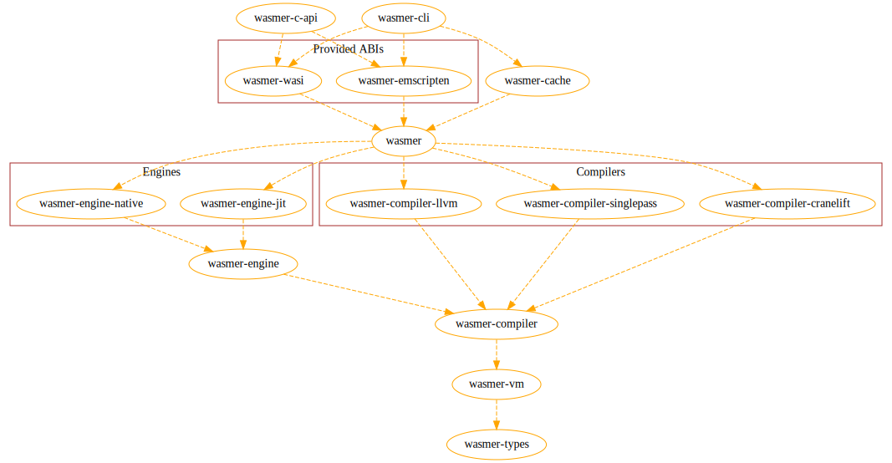

# Migrating from Wasmer 0.x to Wasmer 1.0.0

Wasmer 1.0.0 is currently in alpha and is our primary focus. This document will
describe the differences between 0.x Wasmer and Wasmer 1.0.0 and provide examples
to make migrating to the new API as simple as possible.

Some features are still under development during the alpha of Wasmer 1.0.0. This document
will aim to make clear what these features are.

## Table of Contents

- Rationale for changes in 1.0.0
- How to use Wasmer 1.0.0
- Project structure
- TODO: specific differences

## Rationale for changes in 1.0.0

TODO: explain why 1.0.0 exists

## How to use Wasmer 1.0.0

### Installing Wasmer

See [wasmer.io] for installation instructions.

If you already have wasmer installed, run `wasmer self-update`.

Install the latest versions of wasmer with [wasmer-nightly].

### Using Wasmer 1.0.0

The CLI interface for Wasmer 1.0.0 is mostly the same as it was in Wasmer 0.X.

One difference is that rather than specifying the compiler with `--backend=cranelift`,
in Wasmer 1.0.0 we prefer using the name of the backend as a flag directly,
for example: `--cranelift`.

The top level crates that users will usually interface with are:

- [wasmer] - core API
- [wasmer-wasi] - Wasmer's WASI implementation
- [wasmer-emscripten] - Wasmer's Emscripten implementation
- TODO:

See the [examples] to find out how to do specific things in Wasmer 1.0.0.

## Project Structure

The figure above shows the core Wasmer crates and their dependencies with transitive dependencies deduplicated.

Wasmer 1.0.0 has two core architectural abstractions: engines and compilers.

A compiler is a system that translates Wasm into a format that can be understood
more directly by a real computer.

An engine is a system that processes Wasm with a compiler and prepares it to be executed.

TODO: better explain what the engine actually does

For most uses, users will primarily use the [wasmer] crate directly, perhaps with one of our
provided ABIs such as [wasmer-wasi]. However for users that need finer grained control over
the behavior of wasmer, other crates such as [wasmer-compiler] and [wasmer-engine] may be used
to implement custom compilers and engines respectively.

## Differences

### Instantiating modules

TODO: link to example, etc.

### Passing host functions

TODO: link to example showing advanced uses of the import object, show some example code inline and compare it to old wasmer

### Accessing the environment as a host function

TODO: link to example showing host functions accessing VM internals such as memory, calling other functions, etc., show some example code inline and compare it to old wasmer

### Error handling

TODO: link to example doing error handling, show inline what it looks like and compare it to old wasmer

### Caching modules

TODO: link to example, etc.

### Metering

TODO: link to example, etc.

[examples]: https://github.com/wasmerio/wasmer/tree/master/examples
[wasmer]: https://crates.io/crates/wasmer/1.0.0-alpha3
[wasmer-wasi]: https://crates.io/crates/wasmer-wasi/1.0.0-alpha3
[wasmer-emscripten]: https://crates.io/crates/wasmer-emscripten/1.0.0-alpha3
[wasmer-engine]: https://crates.io/crates/wasmer-engine/1.0.0-alpha3
[wasmer-compiler]: https://crates.io/crates/wasmer-compiler/1.0.0-alpha3
[wasmer.io]: https://wasmer.io
[wasmer-nightly]: https://github.com/wasmerio/wasmer-nightly/
